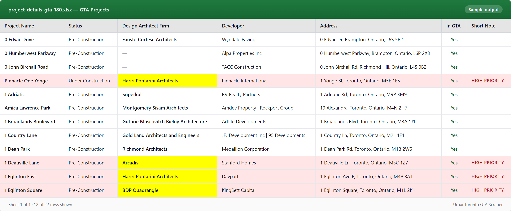

# UrbanToronto GTA Scraper

> Turn UrbanToronto.ca's public project database into a curated, color-coded Excel sheet of upcoming Toronto high-rises — with the architect, developer, and address for every lead, and the priority firms automatically flagged.

[](./LICENSE)
[](https://nodejs.org/)
[](https://pptr.dev/)
[](https://cheerio.js.org/)


 

A 5-step Node.js pipeline that scrapes [UrbanToronto.ca](https://urbantoronto.ca/database/projects)'s project database and produces a curated, formatted Excel workbook of **Pre-Construction projects in the Greater Toronto Area**, with high-priority leads flagged.

Built as a lead-generation tool for facade / glazing / curtain-wall contractors looking to identify upcoming high-rise developments and the architecture firms behind them.

## Quickstart

```bash
git clone https://github.com/replyre/UrbanToronto-GTA-Scraper.git
cd UrbanToronto-GTA-Scraper
npm install

# Fast end-to-end demo (~5 min, ~25 projects)
npm run sample

# Full pipeline (~45–60 min, ~800 projects → top 180 GTA leads)
npm run scrape:paths && npm run scrape:details && npm run filter:gta:180 && npm run mark:gta:priority && npm run xlsx:gta
```

The final deliverable lands at `project_details_gta_180.xlsx`. A pre-generated sample lives at [`samples/project_details_gta_sample.xlsx`](samples/project_details_gta_sample.xlsx) if you'd rather just see what the output looks like.

---

## What it does

1. Pulls all `Pre-Construction` project URLs from UrbanToronto's public API.
2. Visits each project page with a real browser (Puppeteer) and extracts: project name, construction status, architect, engineering firm(s), developer, address, hero image.
3. Filters down to projects in GTA cities (Toronto, Mississauga, Brampton, Markham, etc.).
4. Flags rows as **high priority** if either:
   - The architect is one of a curated list of key firms (KPMB, Hariri Pontarini, Diamond Schmitt, Perkins&Will, etc.), **or**
   - The project description / height suggests a 20+ storey tower with curtain-wall glazing.
5. Exports a styled `.xlsx` with frozen header, autofilter, bold architect column, and yellow-highlighted priority rows.

---

## Requirements

- **Node.js 18 or newer**
- **~500 MB free disk** (Puppeteer downloads its own Chromium build on install)
- Internet access; UrbanToronto.ca must be reachable

```bash
npm install
```

---

## The pipeline

The pipeline has 5 stages. Each is a separate npm script so any stage can be re-run independently.

| # | Command | Reads | Writes | Time |
|---|---|---|---|---|
| 1 | `npm run scrape:paths` | UrbanToronto API | `project_paths_batch_NNNN.txt`, `project_paths_all.txt` | ~3–5 min |
| 2 | `npm run scrape:details` | `project_paths_batch_*.txt` | `project_details.csv`, `project_details_skipped.log` | ~45–60 min |
| 3 | `npm run filter:gta:180` | `project_details.csv` | `project_details_gta_180.csv` | <1 s |
| 4 | `npm run mark:gta:priority` | `project_details_gta_180.csv` | `project_details_gta_180.csv` (rewrites in place) | <1 s |
| 5 | `npm run xlsx:gta` | `project_details_gta_180.csv` | `project_details_gta_180.xlsx` | <1 s |

### Run end-to-end

```bash
npm run scrape:paths && npm run scrape:details && npm run filter:gta:180 && npm run mark:gta:priority && npm run xlsx:gta
```

The final deliverable is **`project_details_gta_180.xlsx`**.

### Sample / demo run *(~5 min)*

For a quick smoke test or to regenerate the screenshot above without scraping all 800 projects:

```bash
npm run sample
```

This chains the same 5 stages but caps step 1 at 40 paths and step 2 at 25 page visits. Both `--limit=N` flags also work directly on the underlying scripts:

```bash
node scrape_project_paths.js --limit=40
node scrape_project_details.js --limit=25
```

### Resume / partial runs

- **Step 1 is resumable.** If you stop it mid-run and restart, it picks up from the last completed batch file. Delete `project_paths_batch_*.txt` to start fresh from API offset 0.
- **Step 2 appends to `project_details.csv`.** Re-running without deleting the CSV first will append duplicates. Delete the CSV before a clean re-run.
- **Steps 3–5 are pure transforms.** Safe to re-run any time.

---

## Use cases

| Scenario | What to run |
|---|---|
| First-ever run / clean slate | All 5 steps in order |
| Weekly refresh of leads | Delete `project_details.csv`, then run all 5 steps |
| Tweaked the architect priority list | Steps 4 + 5 only |
| Tweaked the GTA city list or 180 cap | Steps 3 + 4 + 5 |
| Just want a fresh Excel from existing CSV | Step 5 only |

---

## Configuration

All knobs live at the top of their respective files. No `.env`, no CLI flags — edit and re-run.

### `scrape_project_paths.js`
```js
const BATCH_SIZE = 50;          // URLs per batch file
const PAGE_LIMIT = 50;          // API page size (don't change)
const ALLOWED_STATUSES = ["Pre-Construction"];   // status filter
```

### `scrape_project_details.js`
```js
const DELAY_BETWEEN_REQUESTS = 2000;  // ms between page visits
const GTA_CITIES = [...];             // cities counted as "In GTA"
const HIGH_PRIORITY_KEYWORDS = {...}; // tall / curtain-wall / luxury keywords
```
Browser is **headed** by default (you'll see Chromium open). To run silently, change line ~355:
```js
const browser = await puppeteer.launch({ headless: "new", ... });
```

### `filter_gta_projects.js`
```js
const MAX_PROJECTS = 180;       // how many top GTA rows to keep
```

### `high_priority_architects.js`  *(shared by steps 4 and 5)*
```js
export const HIGH_PRIORITY_ARCHITECTS = [
  "kpmb", "hariri pontarini", "diamond schmitt", ...
];
```
Add or remove firm-name substrings here. Match is case-insensitive.

---

## Output schema

`project_details.csv` and `project_details_gta_180.csv` share these columns:

| Column | Source | Notes |
|---|---|---|
| Project URL | input batch file | UrbanToronto project page URL |
| Project Name | `<h1>` on page | Falls back to `og:title`, `<title>`, then URL |
| Construction Status | "Construction Status" cell | E.g. `Pre-Construction`, `In Design` |
| Design Architect Firm | "Architect" cell | Multi-firm joined with ` \| ` |
| Engineering Firm(s) | "Engineering" cell | Multi-firm joined with ` \| ` |
| Developer | "Developer" cell | Multi-firm joined with ` \| ` |
| Address | "Address" cell | |
| In GTA | derived | `Yes` / `No` based on `GTA_CITIES` match |
| Image URL | `og:image` / `.project-image` | Hero rendering |
| Short Note | derived | `high priority` if flagged, else blank |

The `.xlsx` adds:
- Frozen header row + autofilter
- Bold "Design Architect Firm" column
- Yellow highlight on architect cell when firm is in `HIGH_PRIORITY_ARCHITECTS`
- Pink (`FFE5E5`) row tint on any high-priority row

---

## Files in this repo

### Pipeline scripts
- `scrape_project_paths.js` — step 1
- `scrape_project_details.js` — step 2
- `filter_gta_projects.js` — step 3
- `mark_high_priority_gta.js` — step 4
- `make_gta_xlsx.js` — step 5

### Shared config
- `high_priority_architects.js` — the priority architect list + `isHighPriorityArchitect()` helper, imported by steps 4 and 5

### Repo files
- `LICENSE` — MIT
- `samples/project_details_gta_sample.xlsx` — pre-generated demo output (small subset)
- `samples/project_details_gta_sample.csv` — same data as raw CSV
- `docs/screenshots/output.png` — the screenshot embedded above
- `scripts/generate_screenshot.js` — internal helper that re-renders the screenshot from a fresh `.xlsx`

### Generated at runtime *(not in git, recreated by the pipeline)*
- `project_paths_batch_NNNN.txt` — paginated URL lists from step 1
- `project_paths_all.txt` — flat URL list, all batches deduped
- `project_details.csv` — full scraped dataset
- `project_details_skipped.log` — URLs step 2 couldn't parse
- `project_details_gta_180.csv` — GTA-filtered, priority-marked
- `project_details_gta_180.xlsx` — final deliverable

---

## Troubleshooting

**Step 2 takes forever / Puppeteer hangs.** Each page has a 5-second JS-render wait + 2-second polite delay. 800 URLs × 7s ≈ 90 min worst case. To speed up at the cost of reliability, lower `DELAY_BETWEEN_REQUESTS` and the inner `delay(5000)` in `scrapeProjectWithPuppeteer`.

**`project_details.csv` has duplicate rows.** Step 2 only dedupes within a single run. If you re-ran without deleting the CSV, you'll have dupes. Delete it and rerun, or dedupe by `Project URL` in Excel.

**An architect is not getting flagged as high priority.** The match is a case-insensitive substring on the *exact* "Design Architect Firm" cell text. If the page renders the firm with a long em-dash or non-breaking space, add that variant to `HIGH_PRIORITY_ARCHITECTS`.

**A project's address is in GTA but `In GTA = No`.** The match is a substring against `GTA_CITIES` in `scrape_project_details.js:22`. Add the missing municipality there and re-run step 2 (or hand-edit the CSV and re-run steps 3–5).

**API returns nothing / step 1 stops at offset 0.** UrbanToronto may have changed their API contract. The script expects `{ content: [...], complete: bool }`. Check the response shape against what `buildFormBody()` is sending in `scrape_project_paths.js:19`.

**Puppeteer install failed on Windows.** Run `npm install puppeteer` again with admin shell, or set `PUPPETEER_SKIP_DOWNLOAD=1` and point `PUPPETEER_EXECUTABLE_PATH` at an existing Chrome install.

---

## Dependencies

- [`puppeteer`](https://pptr.dev/) — headless Chromium for JS-rendered pages
- [`cheerio`](https://cheerio.js.org/) — jQuery-style HTML parsing on the server
- [`node-fetch`](https://github.com/node-fetch/node-fetch) — `fetch` for older Node
- [`exceljs`](https://github.com/exceljs/exceljs) — XLSX writer with formatting

---

## Politeness / legal

Step 2 enforces a 2-second delay between page loads and uses a real browser User-Agent. The scraper only reads pages already publicly accessible to any visitor. If UrbanToronto's `robots.txt` or terms change, review before running again.
